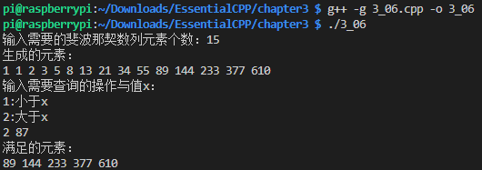

#### 01 STL组织架构图
1. 容器
    1. 顺序容器
            vector
            list
    2. 关联容器
            map
            set
2. 泛型算法
        function template —— 实现与操作对象类型相互独立
        iterator —— 实现与容器无关性

#### 02 Iterator 泛型指针（迭代器）
1. 指针是迭代器的一种
2. 例如：
        vector\<int> svec(10);
        vector\<int>::iterator iter = svec.begin();
3. const_iterator 只允许读取

#### 03 所有容器的共通操作
1. == 与 != 返回true/false
2. = 将某个容器复制给另一个容器
3. empty() 无任何元素时返回true
4. size() 返回容器目前持有的元素个数
5. clear() 删除所有元素
6. begin() 指向第一个元素
   end()   指向最后一个元素的下一个位置
7. insert() 将单一或某个范围内的元素插入容器内
   erase()  将单一或某个范围内的元素删除

#### 04 顺序性容器

创建的容器与数组是*独立的*

1. vector
        #include \<vector>
        随机读取
2. list
        #include \<list>
        双向链表 value  
                back   指向前一个元素
                front  指向下一个元素
3. deque(读作deck)
        #include \<deque>
        与vector不同之处是，对最前、最末端元素的插入与删除的效率更高
        标准库的queue是以deque实现的
4. 定义
    a. 产生空的容器
            list\<string> slist;
            vector\<int> ivec;
    b. 产生特定大小的容器，每个元素都以默认值为初值（对于int与double为0）
            list\<int> ilist(1024);
            vector\<string> svec(32);
    c. 产生特点大小的容器，并为每个元素指定初值
            vector\<int> ivec(10, -1);
            list\<string> slist(16, "TianC")
    d. 通过一对迭代器产生容器，这对迭代器用来标示一整组作为初值的元素的范围
            int ia[8] = { 1, 1, 2, 3, 5, 8, 13, 21};
            vector\<int> fib(ia, ia + 8);
    e. 根据某个容器产生新的容器，复制原容器的元素
            list\<string> slist;             //空容器
            //填充slist...
            list\<string> slist2(slist);     //将slist复制给slist2
5. 特殊的函数
        push_back()     在最末端插入一个元素
        pop_back()      删除最后一个元素,不会返回被删除的元素值
        list和deque还提供了
        push_front()    在最前端插入一个元素
        pop_front()     删除第一个元素,不会返回被删除的元素值

6. 读取两端的元素
        front()         读取最前端元素的值
        back()          读取最末端元素的值
    
7. 四种插入函数变形
        - iterator insert(iterator position, elemType value)
          将value插入position之前
        - void insert(iterator position, int count, elemType value) 
          可在position之前插入count个值为value的元素
        - void insert(iterator1 position, iterator2 first, iterator2 last)
          可在position之前插入[first, last)范围内的元素
        - iterator insert(iterator position)
          在position之前插入一个默认值元素
    

8. 两种删除函数变形
        - iterator erase(iterator position)
          可删除position所指的元素
        - iterator erase(iterator first, iterator last)
          可删除[first, last)范围内的元素

#### 05 使用泛型算法
1. 包含algorithm头文件
    
2. 算法
        - find()            搜索范围为[first,last)，会返回一个迭代器指向该值，否则返回last
        - binary_search()   搜索到目标返回true
        - count()           返回数值相符的元素个数
        - search()          对比是否存在子序列，存在则返回一个迭代器指向起始处
        - max_element()     返回范围内的最大元素值的地址

#### 06 设计一个泛型算法
1. 通过函数调用来取代 "比较操作"
        需使用函数指针作为参数，如 bool (*pred)(int, int)
2. 泛型函数第一版

    
3. Function Object
        a. 包含头文件functional
        b. 一个函数对象，即一个重载了括号操作符“（）”的对象
        当用该对象调用此操作符时，其表现形式如同普通函数调用一般，因此取名叫函数对象
        c.  既然用函数对象与调用普通函数有相同的效果，为什么还有搞这么麻烦定义一个类来使用函数对象？
        主要在于函数对象有以下的优势:
        - 函数对象可以有自己的状态。我们可以在类中定义状态变量，这样一个函数对象在多次的调用中可以共享这个状态。但是函数调用没这种优势，除非它使用全局变量来保存状态
        - 函数对象有自己特有的类型，而普通函数无类型可言。这种特性对于使用C++标准库来说是至关重要的。这样我们在使用STL中的函数时，可以传递相应的类型作为参数来实例化相应的模板，从而实现我们自己定义的规则。比如自定义容器的排序规则
        d. 运算

|算术运算 | 运算符 |关系运算|运算符|逻辑运算|运算符|
|:----:|:----:|:----:|:----:|:----:|:----:|
|plus\<type> | + |less\<type>|<|logical_and\<type>|&&|
|minus\<type> | - |less_equal\<type>|<=|logical_or\<type>|\|\||
|multiplies\<type>|*|greater\<type>|>|logical_not\<type>|!|
|divides\<type>|/|greater_equal\<type>|>=|
|modules\<type>|%|equal_to\<type>|==|
|negate\<type>|-|not_equal_to\<type>|!=|
e. transform 函数对象
            写法：
            transform(fib.begin(),fib.end(),    //第一个容器的范围
                      pell.begin(),             //第二个容器的开始
                      fib_plus_pell.begin(),    //存放的容器开始位置
                      plus<int>()   );          //转换的操作

4. function object adpter 函数对象适配器
        binder adpter 绑定适配器
        binder adpter:bind1st 将指定值绑定到第一个操作数
        binder adpter:bind2nd 将指定值绑定到第二个操作数

        例子：
        bind2nd(less<int>,val) 会把val绑定到less<int>的第二个参数上

        negator 适配器
        not1 可以对unary function object (一元函数对象)的真伪取反
        not2 可以对binary function obiect(二元函数对象)的真伪取反

        例子:
        not1(bind2nd(less<int>,val)) 则相当于 bind2nd(greater_equal<int>,val)

        
```
3_08 运行结果

pi@raspberrypi:~/Downloads/EssentialCPP/chapter3 $ ./3_08
输入需要的斐波那契数列元素个数：
50
生成的元素：
1 1 2 3 5 8 13 21 34 55 89 144 233 377 610 987 1597 2584 4181 6765 10946 17711 28657 46368 75025 121393 196418 317811 514229 832040 1346269 2178309 3524578 5702887 9227465 14930352 24157817 39088169 63245986 102334155 165580141 267914296 433494437 701408733 1134903170 1836311903 -1323752223 512559680 -811192543 -298632863 
输入需要查询的操作与值x：
1:小于x
2:大于x
1 300
found value: 1
found value: 1
found value: 2
found value: 3
found value: 5
found value: 8
found value: 13
found value: 21
found value: 34
found value: 55
found value: 89
found value: 144
found value: 233
found value: -1323752223        //超出了int范围被截断
found value: -811192543         //超出了int范围被截断
found value: -298632863         //超出了int范围被截断
```
```
加了 not1 的 3_08 的运行结果

pi@raspberrypi:~/Downloads/EssentialCPP/chapter3 $ ./3_08
输入需要的斐波那契数列元素个数：15
生成的元素：
1 1 2 3 5 8 13 21 34 55 89 144 233 377 610 
输入需要查询的操作与值x：
1:小于x
2:大于x
1 8
found value: 8
found value: 13
found value: 21
found value: 34
found value: 55
found value: 89
found value: 144
found value: 233
found value: 377
found value: 610
```
#### 07 使用Map
1. map 被定义为一对数值，一个key以及相对应的value
2. 包含于``map``头文件
3. 定义
    map\<string,int> words;
4. words["a"]会查询key ``a`` 对应的value，但若没有则会建立一个并初始化为0
5. 使用map的find()函数查找``words.find("a");``会返回一个迭代器指向这个键值对，否则指向end()
6. ``words.count("a")``会返回``a``在map中的个数
6. 例子
```
    map<string,int> words;
    string tword;
    while(cin >> tword){
	    words[tword]++;
    }

    map<string,int>::iterator it = words.begin();
    for( ; it != words.end(); it++){
    	cout << "key:" << it->first
    	     << "  value:" << it->second << endl;
    }
```
```
输出

pi@raspberrypi:~/Downloads/EssentialCPP/chapter3 $ ./3_09
a a a a f f s s j  k l e r x x d
key:a  value:4
key:d  value:1
key:e  value:1
key:f  value:2
key:j  value:1
key:k  value:1
key:l  value:1
key:r  value:1
key:s  value:2
key:x  value:2
```
#### 08 使用 Set（集合）
1. 包含于``set``库
2. set 由一群 key 组合而成
3. 例子：使用set来排除键入的关键词
    [集合使用的例子](./3_10.cpp)
4. 插入单一元素 ``iset.insert(ival)``
5. 插入某范围的元素 ``iset.insert(vec.begin(),vec.end())``
6. 迭代器 ``set<int>::iterator it = iset.begin()``